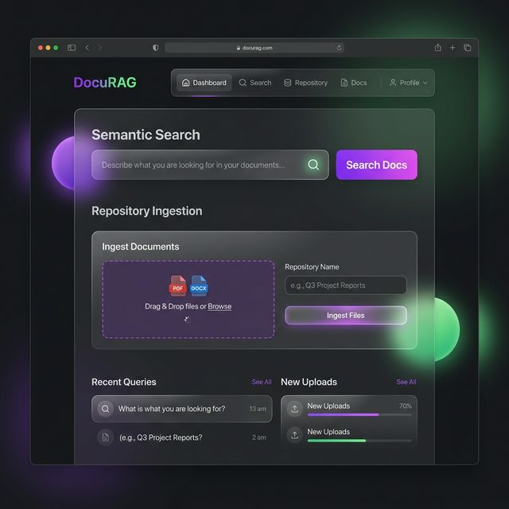
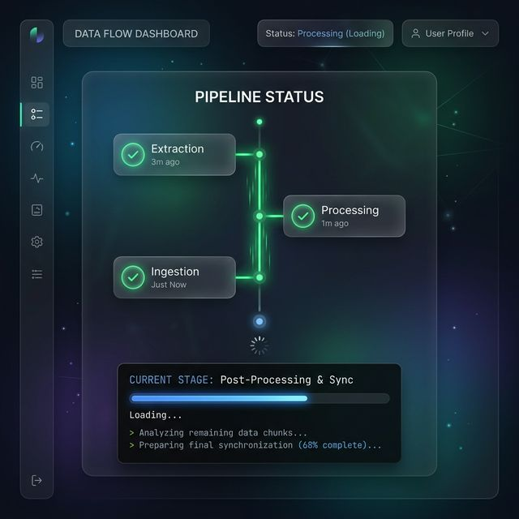

# DocuRAG 🧠

**A free, full-stack open-source RAG pipeline that transforms GitHub repositories into semantic search engines.**



DocuRAG is a complete, local Retrieval-Augmented Generation (RAG) application. It allows anyone to instantly turn complex, fragmented markdown documentation from any public GitHub repository into a lightning-fast semantic search engine.



## ✨ What it Does

Have you ever struggled to find an exact configuration flag in a massive open-source project's documentation? DocuRAG solves this by implementing a full machine learning pipeline directly inside a web app:

1. **Ingestion**: You paste a GitHub URL into the UI.
2. **Extraction**: The python backend downloads the repository and isolates all `.md` and `.mdx` files.
3. **Processing**: It cleans the markdown, strips HTML, and splits the content into overlapping semantic chunks using LangChain.
4. **Embedding**: It processes those chunks through a HuggingFace neural network (`all-MiniLM-L6-v2`) locally to calculate their mathematical vector embeddings.
5. **Storage & Search**: It upserts the vectors into a persistent local ChromaDB instance, allowing you to ask natural language questions and instantly retrieve the exact source file and paragraph containing the answer.

## 🚀 Key Features

- **Dynamic GitHub Ingestion**: Input any public GitHub repository URL directly from the sleek UI.
- **Local Dense Embeddings**: Generates powerful semantic embeddings locally using `sentence-transformers`—100% free with no expensive API keys required.
- **Persistent Vector Storage**: Leverages ChromaDB for blazing-fast semantic similarity search.
- **Animated User Interface**: Features a premium, state-of-the-art React + Vite glassmorphism frontend that provides real-time animated pipeline state tracking.

## 🏗️ Project Architecture

The repository is structured into distinct micro-services:

1. **Extraction/Processing Engine**: Custom Python extractors and LangChain `RecursiveCharacterTextSplitter` chunkers (`extraction/`, `processing/`).
2. **Backend API**: A blazing-fast FastAPI backend (`api.py`) exposing the `/search` and `/ingest` endpoints hooking into ChromaDB (`db/`).
3. **Frontend SPA**: A modern React project (`frontend/`) heavily styled with native CSS for maximum UI flexibility.

---

## 🛠️ Getting Started & How to Use

The project can be run locally or deployed dynamically to Vercel/Render.

### Prerequisites
Ensure you have Python 3.9+ and Node.js installed. Note: The embedding pipeline uses CPU and may take 10-30 seconds to ingest a moderate sized repository.

### 1. Backend Setup (FastAPI + ChromaDB)

Open a terminal at the root of the project to initialize the python environment:

```bash
# Initialize and enter virtual environment
python -m venv venv
source venv/bin/activate  # On Windows, use `venv\Scripts\activate`

# Install required packages
pip install -r requirements.txt

# Start the FastAPI web server
python api.py
```
The FastAPI server will boot up with hot-reloading at `http://localhost:8000`.

### 2. Frontend Setup (React + Vite)

Open a second terminal window, navigate to the frontend directory, and start the React dev server:

```bash
cd frontend
npm install
npm run dev
```
The frontend UI will boot up at `http://localhost:5173`. 

### 3. Usage
1. Open the UI in your browser.
2. Under **Step 1: Ingest Repository**, paste a GitHub URL (e.g. `https://github.com/tiangolo/fastapi`) and click **Ingest Repo**.
3. Watch the pipeline timeline animate as it processes the files.
4. Once completed, the **Step 2: Semantic Search** bar will unlock.
5. Ask a question like "How do I use dependency injection?" and watch DocuRAG fetch the exact code blocks!
