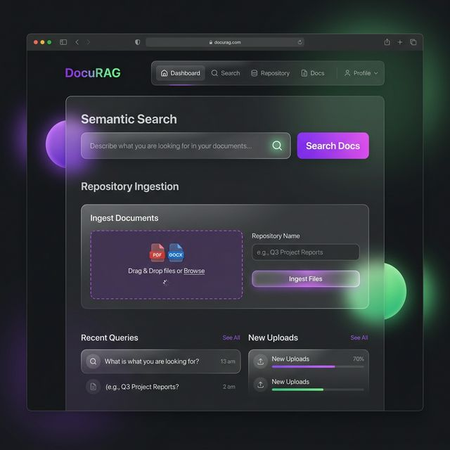
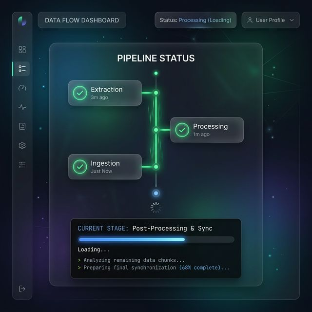
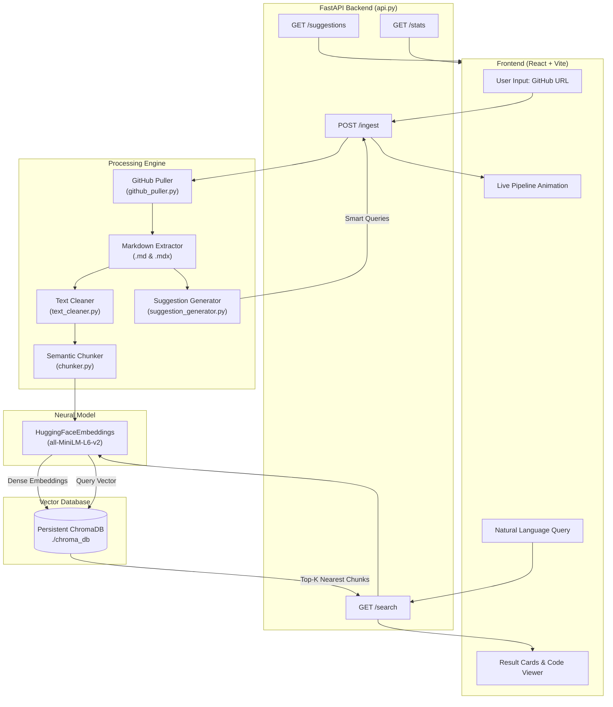

# DocuRAG 🧠

**A free, full-stack, open-source RAG pipeline that transforms GitHub repositories into high-performance semantic search engines.**

[](https://www.python.org/)
[](https://fastapi.tiangolo.com/)
[](https://react.dev/)
[](https://www.trychroma.com/)
[](https://huggingface.co/sentence-transformers/all-MiniLM-L6-v2)
[](https://www.langchain.com/)
[](https://opensource.org/licenses/MIT)

---

### 🟢 Live Demo
* **Web Application**: [https://docu-rag-website.vercel.app/](https://docu-rag-website.vercel.app/)
* **Interactive API Docs (Swagger UI)**: [https://docurag-ip3k.onrender.com/docs](https://docurag-ip3k.onrender.com/docs)

---

## 📸 Screenshots & UI Showcase

### 1. Semantic Search Interface
Search across indexed repositories using plain English questions. Get instant semantic matches with highlighted code blocks, repository tags, chunk indexes, and direct source file paths.



### 2. Real-Time Pipeline Tracker
Visual timeline tracking the ingestion pipeline in real time: from GitHub cloning and file extraction to HTML cleaning, chunking, and neural embedding upsertion into ChromaDB.



---

## 💡 What is DocuRAG & What Problem Does It Solve?

When working with modern open-source repositories (such as FastAPI, Flask, Starlette, or LangChain), documentation is frequently scattered across dozens or hundreds of `.md` and `.mdx` files.

### The Limitations of Traditional Search (Lexical / Ctrl+F)
* **Exact Keyword Dependency**: If you search for `"user permissions"`, but the documentation author wrote `"OAuth2 scopes"` or `"role-based authorization"`, standard keyword search returns **0 results**.
* **Fragmented Context**: GitHub repository search and basic browser find tools cannot synthesize across multiple files or rank results by conceptual relevance.
* **Cost & API Keys**: Most AI search tools rely on costly external API keys (OpenAI, Anthropic) and send your proprietary or local codebase data over external networks.

### The DocuRAG Solution
DocuRAG provides a complete, self-hosted **Retrieval-Augmented Generation (RAG) search pipeline**:
1. **Dynamic Ingestion**: Paste any public GitHub repo URL or shorthand (`owner/repo`).
2. **Intelligent Cleaning**: Cleans raw markdown while safeguarding code blocks and typing generics (like `List[str]`).
3. **Dense Vector Embeddings**: Uses HuggingFace's `all-MiniLM-L6-v2` locally on CPU—**100% free with no API keys required**.
4. **Local Vector Database**: Persists embeddings in ChromaDB for sub-second nearest-neighbor vector search.
5. **Exact Attribution**: Every retrieved result points directly to its source file and chunk position.

---

## 🔍 Understanding Semantic Search

### Lexical Search vs. Semantic Search

| Feature | Lexical (Keyword) Search | Semantic (DocuRAG) Search |
| :--- | :--- | :--- |
| **Mechanism** | String and substring exact matching | Mathematical vector proximity in high-dimensional embedding space |
| **Query Flexibility** | Must match exact terminology used by author | Natural language questions, synonyms, and conceptual queries |
| **Synonym Handling** | Requires manual synonym dictionaries | Inherent via neural network language comprehension |
| **Example Query** | `"dependency injection"` $\rightarrow$ Only finds exact phrase | `"How do I pass database sessions to endpoints?"` $\rightarrow$ Finds `Depends()` documentation |

### How It Works Mathematically
1. **Text Embedding**: Sentences and documentation chunks are transformed by a neural model into 384-dimensional dense vectors ($\vec{v} \in \mathbb{R}^{384}$).
2. **Semantic Proximity**: Semantically related concepts are positioned close to one another in this vector space.
3. **Cosine Similarity**: When a user submits a query $q$, its query vector $\vec{v}_q$ is compared against all indexed chunk vectors $\vec{v}_d$ using cosine similarity:
   $$\text{Cosine Similarity}(\vec{v}_q, \vec{v}_d) = \frac{\vec{v}_q \cdot \vec{v}_d}{\|\vec{v}_q\| \|\vec{v}_d\|}$$
4. **Nearest-Neighbor Retrieval**: ChromaDB indexes these embeddings and retrieves the top-$k$ nearest neighbors in milliseconds.

---

## 🏗️ System Architecture


```mermaid
flowchart TD
    subgraph UI ["Frontend (React + Vite)"]
        A["User Input: GitHub URL"]
        B["Natural Language Query"]
        C["Live Pipeline Animation"]
        D["Result Cards & Code Viewer"]
    end

    subgraph API ["FastAPI Backend (api.py)"]
        E["POST /ingest"]
        F["GET /search"]
        G["GET /suggestions"]
        H["GET /stats"]
    end

    subgraph Engine ["Processing Engine"]
        I["GitHub Puller<br/>(github_puller.py)"]
        J["Markdown Extractor<br/>(.md & .mdx)"]
        K["Text Cleaner<br/>(text_cleaner.py)"]
        L["Semantic Chunker<br/>(chunker.py)"]
        M["Suggestion Generator<br/>(suggestion_generator.py)"]
    end

    subgraph Embedding ["Neural Model"]
        N["HuggingFaceEmbeddings<br/>(all-MiniLM-L6-v2)"]
    end

    subgraph Storage ["Vector Database"]
        O[("Persistent ChromaDB<br/>./chroma_db")]
    end

    %% Ingestion Flow
    A --> E
    E --> I
    I --> J
    J --> K
    K --> L
    J --> M
    L --> N
    N -->|"Dense Embeddings"| O
    M -->|"Smart Queries"| E
    E --> C

    %% Search Flow
    B --> F
    F --> N
    N -->|"Query Vector"| O
    O -->|"Top-K Nearest Chunks"| F
    F --> D
    G --> UI
    H --> UI
```

---

## ⚙️ Detailed Pipeline Stages

### 1. Ingestion & Normalization (`extraction/github_puller.py`)
- Accepts standard URLs (`https://github.com/owner/repo`) or shorthands (`owner/repo`).
- Tries canonical branch heads (`main.zip`, `master.zip`, `HEAD.zip`) and extracts the repository to a temporary workspace.
- Filters out non-documentation and dependency folders (`node_modules`, `.git`, `venv`, `build`, `dist`).

### 2. Code-Preserving Markdown Cleaning (`processing/text_cleaner.py`)
- Standard HTML cleaners often strip code generics like `List[str]` or `<Component />`.
- DocuRAG solves this by **masking code blocks and inline backticks** (`__DOCURAG_CODE_BLOCK_X__`), removing images, normalizing links to anchor text, running BeautifulSoup HTML stripping, and restoring the code blocks intact.

### 3. Recursive Semantic Chunking (`processing/chunker.py`)
- Utilizes LangChain's `RecursiveCharacterTextSplitter` with intelligent boundary priorities (`["\n\n", "\n", " ", ""]`).
- Default chunk size: **1,000 characters** with an overlap of **100–200 characters** to prevent cutting sentences or code blocks mid-thought.
- Discards empty or trivial chunks ($< 20$ characters) to keep vector storage dense and relevant.

### 4. Smart Query Suggestions (`processing/suggestion_generator.py`)
- Automatically analyzes repository headings and documentation structures to synthesize intelligent search suggestions tailored to the specific library.
- Includes pre-tuned queries for popular repositories (FastAPI, Flask, Starlette, Requests).

### 5. Local Neural Embeddings (`ingestion/embedder.py`)
- Uses `sentence-transformers/all-MiniLM-L6-v2` loaded through `langchain-huggingface`.
- Cached using `@lru_cache` to ensure the neural weights stay warm in memory across requests without repeated disk reloads.
- Runs natively on CPU in seconds.

### 6. Vector Upsertion & Search (`db/vector_store.py`)
- Upserts document chunks, dense vectors, and structured metadata into ChromaDB.
- Assigns deterministic chunk IDs (`{repo}_{file_path}_{chunk_idx}`) to support idempotent updates.
- Supports scoped filtering by repository name (`repo_filter`).

---

## 📊 Example Search Results & API Output

### Example 1: Command-Line Search Query
```bash
python main.py search "How do I use dependency injection in FastAPI?"
```

#### Output:
```text
Searching for: 'How do I use dependency injection in FastAPI?'

--- Result 1 (Source: docs/en/docs/tutorial/dependencies/index.md, Index: 0) ---
FastAPI has a very powerful but intuitive **Dependency Injection** system.
It is designed to be very simple to use, and to make it very easy for any developer to integrate
other components with FastAPI.

What is "Dependency Injection"?
In programming, "dependency injection" is a way for your code to declare things that it requires
to work and use them...

--- Result 2 (Source: docs/en/docs/tutorial/dependencies/classes-as-dependencies.md, Index: 1) ---
Before continuing with the example, let's see how `Depends` works with classes...
from fastapi import Depends, FastAPI
app = FastAPI()
```

---

### Example 2: Structured JSON API Response (`GET /search`)
```json
{
  "query": "How to configure CORS middleware safely?",
  "total_found": 1,
  "results": [
    {
      "repository": "fastapi",
      "source": "docs/en/docs/tutorial/cors.md",
      "chunk_index": 2,
      "text": "from fastapi.middleware.cors import CORSMiddleware\n\napp.add_middleware(\n    CORSMiddleware,\n    allow_origins=origins,\n    allow_credentials=True,\n    allow_methods=[\"*\"],\n    allow_headers=[\"*\"],\n)"
    }
  ]
}
```

---

## 🚀 Installation & Setup Guide

### Prerequisites
- **Python**: Version 3.9, 3.10, 3.11, or 3.12 (Python 3.13 supported)
- **Node.js**: Version 18+ and `npm`
- **Git**

---

### 1. Clone the Repository
```bash
git clone https://github.com/VinayakNair/DocuRAG.git
cd DocuRAG
```

---

### 2. Backend Setup (FastAPI + ChromaDB)

1. **Create and activate a Python virtual environment:**
   ```bash
   # macOS / Linux
   python3 -m venv venv
   source venv/bin/activate

   # Windows (PowerShell)
   python -m venv venv
   .\venv\Scripts\Activate.ps1
   ```

2. **Install backend dependencies:**
   ```bash
   pip install -r requirements.txt
   ```

3. **(Optional) Run the Standalone Pipeline Script:**
   You can ingest a sample repo and test the pipeline directly in your terminal:
   ```bash
   python main.py
   python main.py search "How do I secure endpoints?"
   ```

4. **Start the FastAPI Backend Server:**
   ```bash
   python api.py
   ```
   * The API server will start at: `http://localhost:8000`
   * Interactive Swagger documentation: `http://localhost:8000/docs`

---

### 3. Frontend Setup (React + Vite)

Open a new terminal tab and navigate into the `frontend` directory:

1. **Navigate to the frontend directory:**
   ```bash
   cd frontend
   ```

2. **Install Node dependencies:**
   ```bash
   npm install
   ```

3. **Configure the API URL (Optional):**
   By default, the frontend connects to `http://localhost:8000`. To customize, create a `.env` file in the `frontend` folder:
   ```env
   VITE_API_URL=http://localhost:8000
   ```

4. **Start the Vite development server:**
   ```bash
   npm run dev
   ```
   * Open your browser and navigate to `http://localhost:5173`.

---

## 🧪 Running Automated Tests

DocuRAG includes a test suite covering API endpoints, text cleaners, chunkers, URL normalizers, suggestion generators, and vector store operations.

```bash
# Ensure your virtual environment is active
pytest
```

```text
============================= test session starts ==============================
collected 39 items

tests/test_api.py ........                                               [ 20%]
tests/test_chunker.py ....                                               [ 30%]
tests/test_e2e_pipeline.py .                                             [ 33%]
tests/test_embedder.py ...                                               [ 41%]
tests/test_github_puller.py ......                                       [ 56%]
tests/test_main.py ...                                                   [ 64%]
tests/test_suggestion_generator.py .....                                 [ 76%]
tests/test_text_cleaner.py ......                                        [ 92%]
tests/test_vector_store.py ...                                           [100%]

============================== 39 passed in 8.42s ==============================
```

---

## 📡 REST API Reference

The backend exposes RESTful endpoints with automatic OpenAPI documentation available at `/docs`:

| Method | Endpoint | Description | Sample Query / Payload |
| :--- | :--- | :--- | :--- |
| `GET` | `/health` | Health and operational status | `curl http://localhost:8000/health` |
| `GET` | `/stats` | Vector store counts and indexed repos | `curl http://localhost:8000/stats` |
| `GET` | `/suggestions` | Get smart suggested queries for a repo | `curl "http://localhost:8000/suggestions?repo=fastapi"` |
| `POST` | `/ingest` | Ingest and embed a GitHub repository | `{"github_url": "https://github.com/tiangolo/fastapi"}` |
| `GET` | `/search` | Semantic query against stored documents | `curl "http://localhost:8000/search?q=CORS&n_results=5"` |

---

## 📁 Repository Structure

```text
DocuRAG/
├── api.py                     # FastAPI web server and route definitions
├── main.py                    # Standalone CLI pipeline execution script
├── requirements.txt           # Python dependency specifications
├── chroma_db/                 # Persistent local Chroma vector database files
├── docs/                      # Screenshots, diagrams, and assets
│   ├── hero.png               # Search UI screenshot
│   └── pipeline.png           # Ingestion pipeline screenshot
├── db/
│   ├── __init__.py
│   └── vector_store.py        # ChromaDB client, upsert, and query logic
├── extraction/
│   ├── __init__.py
│   └── github_puller.py       # GitHub archive downloader & markdown extractor
├── processing/
│   ├── __init__.py
│   ├── chunker.py             # LangChain text splitter implementation
│   ├── text_cleaner.py        # BeautifulSoup cleaner with code masking
│   └── suggestion_generator.py# Dynamic query generator for ingested docs
├── ingestion/
│   ├── __init__.py
│   └── embedder.py            # Cached HuggingFace sentence-transformers
├── frontend/                  # React + Vite Glassmorphism SPA
│   ├── src/
│   │   ├── App.jsx            # Main React application & state management
│   │   ├── App.css            # Custom CSS styling and animations
│   │   └── components/        # UI components & background visuals
│   ├── package.json           # Frontend dependencies
│   └── vite.config.js         # Vite configuration
└── tests/                     # 30 automated unit and integration tests
    ├── test_api.py
    ├── test_chunker.py
    ├── test_github_puller.py
    ├── test_suggestion_generator.py
    ├── test_text_cleaner.py
    └── test_vector_store.py
```

---

## 🛠️ Tech Stack & Key Libraries

- **FastAPI**: Asynchronous high-performance web framework for the backend API.
- **ChromaDB**: Lightweight, embeddable vector database running locally with persistent disk storage.
- **Sentence Transformers (`all-MiniLM-L6-v2`)**: Compact, fast 384-dimensional dense neural embedding model.
- **LangChain**: Text splitting via `RecursiveCharacterTextSplitter`.
- **BeautifulSoup4**: Robust HTML parsing and sanitizer for markdown files.
- **React & Vite**: Fast frontend interface featuring glassmorphism and real-time state tracking.
- **Pytest**: Automated test suite for backend verification.

---

## 📄 License

This project is licensed under the [MIT License](LICENSE).
